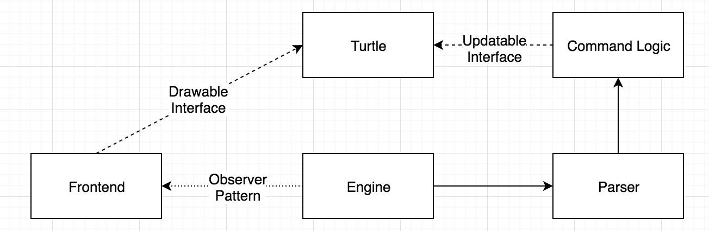

For the backend, input is passed into the `Engine` class from the frontend which then delegates the input string to the `Parser`. The `Parser` immediately asks the `Sanitizer` to format the input string in a desirable way by putting a single whitespace between significant characters, while leaving lists as singular, concatenated strings. (Sidenote: we chose to leave lists as one large string because it made it more straightforward to consider lists as arguments. For example,`if` is a `Command` that take two arguments: the first is an `expr` and the second is a list of commands, `[ command(s) ]`. We felt this was the most straightforward way to pass lists as arguments, which our design required.) Once the `Parser` has the input formatted in the proper way, it traverses each of the "trees" nested within a given input string, creating and executing nodes as it parses the input. The "tree" is simulated with recursion inside of `traverse()`. The `CommandFactory` delegates instantiation of `Commands` to specific `Factory` objects that recognize a given command. The `CommandFactory` ultimately returns an `Iterable<Command>` that the `Parser` can then iterate over and operate on. The final result is returned to Engine where it is ultimately passed to the frontend.

The highest-level class on the frontend is `Visualizer`. On valid commands, `Visualizer` delegates to `Canvas` the responsibility of updating the `Drawable` objects on-screen and tells the `Console` what to print. The UI components like `HelpBox`, `SideBar`, and `Toolbar` all have some kind of action that is triggered on them whenever the user interacts with those components.

There is also a `Turtle` class which implements two different interfaces, one for the frontend and one for the backend. As I've alluded to previously, the type that the frontend holds to interact with the `Turtle` is called a `Drawable`. It exposes methods used in displaying the `Turtle` on-screen. The interface exposed to the backend is called the `Updatable`, which the `Command` objects use to update the `Turtle`'s state on an executed `Command`, if necessary. This means that each of the "ends" only has access to the methods that we want them to use.

Adding a `Command` to the language is relatively straightforward. Depending on what kind of command it is, you may want it to extend a specific kind of command (like `Boolean`, if it's a command that deals with booleans). Regardless, if it's a command that has some effect on the `Turtle`, you'll want the new `Command` to extend `UpdatableCommand`, which is an abstract class that requires the implementation of one method:

```java
protected double calcValues(Updatable updatable, List<Double> args) {
	// operate on Updatable
}
```

If it's a new `Command` that has no effect on the `Turtle` (i.e., in the same vein as the math commands or boolean commands), you'll want that command to extend `NonUpdatableCommand`, which is an abstract class that, again, requires the implementation of one method:

```java
protected double calcValue(List<String> args) {
	// calculate result
}
```
The `Command` hierarchy has been carefully designed with the addition of new `Command` objects in mind, and this single method simple implementation results from that.

Additionally, you'll have to add the new `Command` name to Command.properties and specify the absolute file path of your new command class, and you'll also have to specify the kind of factory that should create it in Factory.properties. Depending on the kind of `Command` you've created, you may have to add a new if statement to successfully create the new `Command` (this isn't true for the `UpdatableFactory` and `NonUpdatableFactory` commands, which use reflection to instantiate new `Command` objects).

In general, I think that the dependencies are fairly easy to find. Some of the logic in the `Command` inheritance hierarchy can occasionally be hard to follow if you've never seen the structure before because things are subclassed multiple times and make use of protected methods. Nevertheless, I was intentional about making all of my instance variables private, so that the only thing that can be a little tricky to figure out is in which superclass (or supersuperclass) a method is defined. One example is in the following method inside `NonUpdatableCommand`:

```java
/**
 * This function gets the arguments from its superclass and passes them allong to be calculated
 * by the concrete instance of a NonUpdatableCommand object.
 */
@Override
public String execute() {
	if (! isReady()) {
		throw new CommandArgsUnfilledException("This Command object needs more arguments to finish executing.");
	}

	double ans = calcValue(replaceVars(getArgs()));
	visCommand(new Result(ans));
	return Double.toString(ans);
}
```

It wouldn't take too long to recognize that `replaceVars()`, `getArgs()`, and `visCommand()` aren't defined within this class and aren't called on an instance or class, but it might be annoying to go look for the method definitions inside the superclass if you were pressured for time.

Additionally, there are a couple of times where input is passed through a method whose sole job is to pass the input along, and that can make it difficult to trace dependencies. For example, when a user selects a new language in the frontend UI component, the `Visualizer` class calls `myChangeListener.changeLanguage()`, where `ChangeListener` is an interface that `Engine` implements. `Engine`'s `changeLanguage()` method then calls `myParser.updateLanguage()`, which in turn calls `myCommandFactory.updateLanguage()`. That final call ultimately handles the updating that I would like to happen, but the call `myParser.updateLanguage()` is pretty useless -- it just continues a chain of calls that is difficult to track. Instead, I should inject the `CommandFactory` into `Parser` as a dependency, allowing Engine to hold a reference to `myCommandFactory` and allowing it to skip the `myParser.updateLanguage()` call. This dependency injection also allows Engine to later swap out the `CommandFactory` for a different implementation, should we choose to use it later. This decouples the `Parser` and the `CommandFactory` further and solves the issue of a string of method calls that aren't very active.

There is also a strong dependency between the `Parser` and individual `Command` objects, but that is totally reasonable. The `Parser` needs to know how `Command` objects accept arguments and when it can execute them, so it is written very precisely using the API that the `Command` objects expose. It doesn't have a ton of freedom in how it handles those `Command` objects, but, again, that's a product of the fact that the `Parser` is parsing very directly in tandem with the API that the `Command` objects expose, and I don't see a real way around that. 

// FRONTEND ARCHITECTURE OVERVIEW AND FRONTEND DEPENDENCIES

One of the big discussions we had at the beginning of this project was how we were going to pass information between the different parts of the program. One early proposal was to have the frontend talk to the `Parser`, have the `Parser` talk to the `Command` objects, have the `Command` objects respond to the `Parser`, and have the `Parser` respond back to the front end. It would have looked something like this:


However, we knew that we wanted to isolate our frontend from any of the command or parsing logic in the backend. For that reason, we made use of the [Observer Pattern](http://www.oodesign.com/observer-pattern.html) described on the OODesign page, which allowed us to decouple our frontend and backend significantly. This allows for much greater flexibility in how the backend is implemented. We chose to have our `Engine` class implement a `ChangeListener` interface which contains two methods, `changeInput()` and `changeLanguage()`. Those two implementations in `Engine` are here:

```java
@Override
public void changeInput(String input) {
	Result result;
	try {
		double ans = myParser.parse(input);
		result = new Result(ans);
	} catch (Exception e) {
		result = new ErrorResult(Double.MAX_VALUE, e.getMessage());
	}
	
	myVis.runCommand(result, true);
}

@Override
public void changeLanguage(String lang) {
	myCommandFactory.updateLanguage(lang);
}
```

As you can see, the frontend doesn't need to know about any of the details. All the frontend has to do is pass the methods the right arguments, and the rest of the magic happens behind the scene. `Engine` delegates to the `Parser` to get the results of a given command and to the `CommandFactory` to update the language.

As such, our chosen design, which I think is much improved from the original diagram I displayed above, looks like the following:




