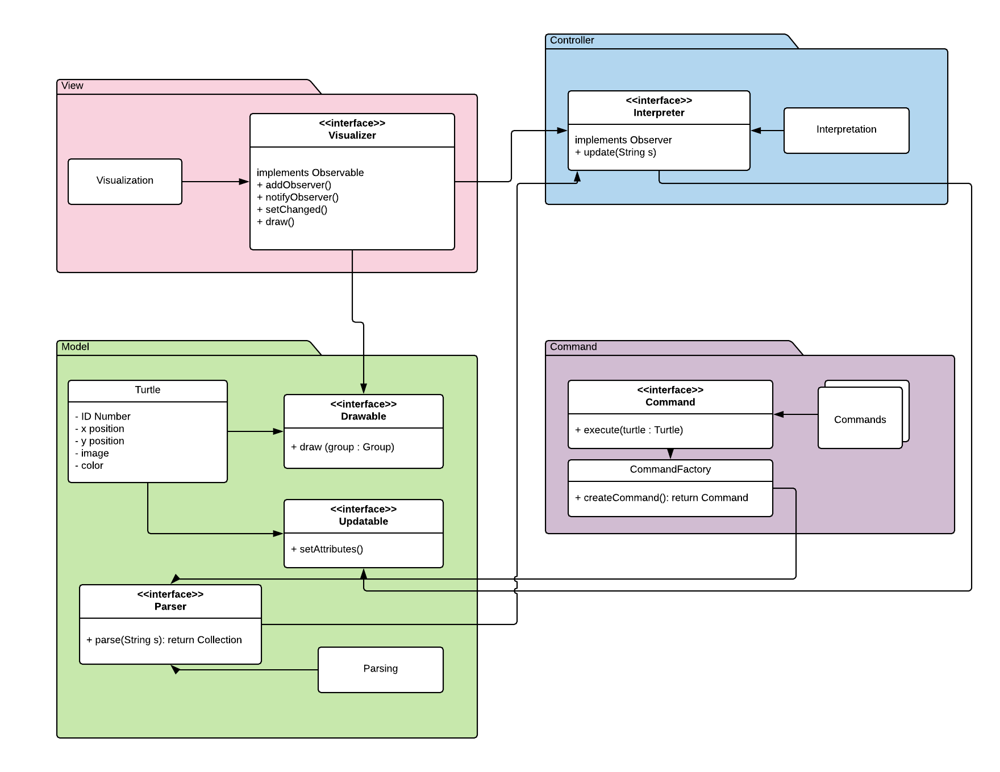
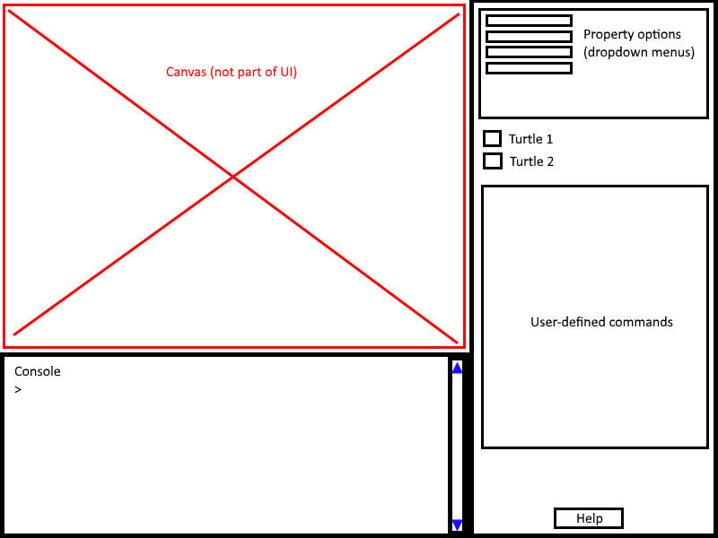

Ben Hubsch (bah37)
Jennifer Chin (jrc81)
Julia Long (jbl34)
Maya Messinger (mm479)

PLAN
===

### Introduction
Our team is making a SLogo environment that will allow a user to command a turtle on a per expression basis. Our team is trying to make adding new features as easy as possible, whether that be a new visual component, new command, or another turtle on the screen. Because this program is so dependent upon user input, we will throw a lot of exceptions pertaining to faulty user input in the back end that can be displayed as an alert in the front end, and that won't crash our program. Our design is based off of the Model View Controller design pattern, with our Turtle and its 2 interfaces, Updatable and Drawable, as the Model, Interpreter and its helper classes such as Parser and Command as the Controller, and the Visualizer as the View. Visualizer will implement the Observable interface and Interpreter will implement the Observer interface so that Interpreter can easily observe new user input. Easily being able to extend this project is one of our main design goals.

### Design Overview

Our project will be divided into 4 parts, or packages: View, Model, Controller, and Command. 
#### View
View is the part of the program that will control everything that the user sees. There will be a main Visualizer interface that is implemented by the Visualization class. This interface will also implement Observable, so that the Controller part of the project can monitor the text box that the user types commands in. Three of the public methods in this interface are ones from the Observable interface, specifically addObserver(), notifyObserver(), and setChanged(). The other public method of the Visualizer interface is draw(), which will call a Drawable object to draw itself on the user's screen. There will be other private methods within the Visualization class that assist in the creation of the user interface.
#### Model 
The Model package will contain our Turtle object. The Turtle will hold private instance variables, including an ID number that identifies which turtle that object is, an x and y postition, an image, and a color. It will also implement two interfaces-- Drawable and Updatable-- so that the Turtle can hold all relevant information for both the Controller and View portions of the project, without either part being able to modify the other. The Drawable interface will contain one public method: draw, which takes in a JavaFX group, so that the turtle can draw itself on the screen. The Updatable interface contains several public setters, so that the Controller portion of the project can update the Turtle as needed.  
#### Controller
The Controller component will have two classes, Parsing and Interpretation, that implement two interfaces, Parser and Interpreter, respectively. The Parser interface will take a String and return a Collection of Objects, specifically, Command objects, after parsing it. The Interpreter interface will implement the Observer interface so that it can observe the text box in the Visualization class, as mentioned earlier. It will have a public update method that allows it to update the Turtle objects through the Updatable interface.
#### Command
The Command interface will be implemented my a number of Command subclasses. There will be a Command subclass for every type of action. The Parser will create new Command objects through the CommandFactory class and return a Collection of them to the Interpreter through the createCommand method. These commands will have a public method execute() that takes in a Turtle object and updates the Turtle.

### User Interface

The user interface will consist of two main parts: the console for text entry of commands, and a sidebar of options with buttons/menus that can be modified by the user to change elements of the visualization. The console will be optimized for multi-line commands, so it will not execute on enter/return, but on the click of a "run" button. The user will be able to scroll, as well, to see previous commands entered. Errors of incorrect commands will result in the command simply being ignored by backend, and an alert box stating that the command was improper (user can close alert and type something else). There will be a help button that will pop up a window displaying supported commands if a user needs help formatting.
For the options sidebar, there will be mostly buttons or drop-down menus that allow the user to change variables such as background color, turtle image, and pen color. The images/colors can to be chosen from a pre-selected list, so that user input error (wrong file type, null, wrong format, etc) will be avoided. There should be no need to display errors. User-defined commands, once entered, will also display in the sidebar and can be selected with a click. This will copy the function into the console, which the user can then modify or run as normal text entry.


### API Details
public interface Interpreter implements Observer
* public void update(String s) {}

The purpose of this API is to provide a bridge from the Visualizer to the Turtle, so that the user input will properly update the state of the Turtle.

The Interpreter will implemented by classes that are responsible for controlling the Model portion of the project, in this case our Turtle. The Interpreter will implement the Observer interface because it will need to observe the text box in the Visualizer. This interface will call an update method when it is notified of a change in the text box, which will update the Updatable interface of the Turtle object.

The Interpreter's external API only consists of the update method, which needs to be accessible to other parts of the project in order to update the Turtle. Other helper methods that can assist with other requirements of the project can be contained within Interpreter or at most within the Controller package, so these methods would be able to remain private. Because the Interpreter will only access the Updatable interface of the Turtle object, it will be simple to switch from Turtle objects to another object that implements the same Updatable interface. 

public interface Vizualization implements Observable
* public void addObserver(Observer obs) {}
* public void notifyObservers (Object arg) {}
* protected void setChanged() {}
* public void draw() {}

The Visualizer interface will be implemented by classes that are responsible for setting up the View of the project. The Visualizer acts as the View of our program, since we are using the Model View Controller design pattern. Subclasses will place the text box, main canvas, and sidebar menu in a Scene. The Visualizer interface will need to deal with user input, and pass that input to the backend in order to update the program. The Visualizer interface will implement the Observable interface so that any new user input can easily be observed by the Interpreter. Once the back end has adjusted to the new user input, the Visualizer will need to be able to update the view accordingly. In order to add new features to the view, the programmer will need to create or add to a class implementing Visualizer.

The Visualizer's external API will consist of methods that the Interpreter will need to call on its Visualizer instance variable. The Interpreter only needs to know when user input has been changed or added to the view. The Visualizer's internal API will consist of methods that will use JavaFX to create the front end of our prorgram. There will be a main view class, as well as text box, canvas, sidebar, and probably numerous other subclasses. A subclass of the Visualizer interface will create some aspect of the GUI, and that aspect will then be added to the GUI in the main class. 

public interface Drawable
* public void draw(Group g) {}

The Drawable API will be implemented by the turtle. The purpose of this API is to split the model (turtle) object of the project into effectively two separate parts: a backend with values, and a frontend image - the Drawable interface handles the frontend visualization of the turtle. This interface allows for a large amount of flexibility within an individual class' implementation of draw(), which any accessing object doesn't need to know the details of. Any object implementing Drawable will have draw() call private methods that call upon the object's unique features.

public interface Updatable
* public setter methods called by Command
    * setX() {}
    * setY() {}
    * setColor() {}
    * etc.

The Updatable API will be comprised of a collection of setter methods that allow an object that implements this interface to be modified. This will be implemented by the Turtle, so that the Interpreter classes can modify it without actually having to hold an instance of the Turtle itself. This allows the actual object to be modified and changed without having to modify the Interpreter interface itself, because the Interpreter will never know which object is implementing the Updatable interface that it is modifying, and only the interface itself.

public interface Parser
* public Collection parse(String s) {}

The purpose of this API is to take in a String passed in by the user, and return a Command object that encapsulates the desired behavior for the turtle.

The Parser interface will be implemented by a Parsing class. The Interpreter will call the Parser when it has been notified by the Visualizer that the user has put a new string that needs to be turned into a command. The Parser will take in a String and split it up into correct commands and values, and then pass those commands and values to the CommandFactory, which will pass back Command objects, which will be returned in a Collection of Commands from the parse method.

This interface will "parse" any inputs by the user, decide if they are valid, and then pass the arguments to the CommandFactory so that the correct command can be created. The validity at this stage will simply be determined by the structure of the argument, and not the actual argument itself. This flexibility will allow a variety of new commands to be implemented as long as they have a valid structure and will be recognized by the CommandFactory.

public interface Command
* public void execute(Turtle t) {}

public interface CommandFactory
* public void createCommand() {}

### API Example Code
#### *The user types 'fd 50' in the command window, and sees the turtle move in the display window leaving a trail, and the command is added to the environment's history.*

``` java
public class Visualization implements Visualizer {
    
}

public class Turtle implements Drawable, Updatable {
    public void draw(Group g)    {
        g.add(this);    // adds self to Scene's group to be displayed, so when Visualizer calls update, turtle will show in new position
    }
}

public class Console implements TextInput {
    public void run()    {
        Interpretation.update(myTextArea.getText());
        clear();
    }
    
    public void clear() {
        myTextArea.clear();
    }
    
    public void loadInput(String command) {
        myTextArea.appendText("\n" + command));    // "types" long command into textbox for the ability to re-use a pre-defined function
    }
    
    public void scrollUp() {
        // view previous line of code, above currently displayed code, in the console
    }
    
    public void scrollDown() {
        // view following line of code, below currently displayed code, in the console
        // if no following lines, do nothing
    }
}

public class HelpBox implements TextDisplayWindow {
    public void open()    {
        // make new Stage
        // insert help (command manual) text into new scene
        // display scene
    }
    
    public void close() {
        Stage toClose = this.getScene().getWindow();
        toClose.close();
    }
}

public class Interpretation implements Interpreter {
    public void update('fd 50'){
        // some code
        Collection commands = Parsing.parse('fd 50');
        // more code
    }
}

public class Parsing implements Parser { 
    public Collection parse('fd 50'){
    // some code
    Command command =  CommandFactory.createCommand('fd',50);
    // more code
    return commands
    }
}

public class CommandFactory {

}
```

#### *The user types 'setxy 40 50' in the command window, and sees the turtle reposition itself without a trail, and the command is added to the environment's history.*
``` java 
// view implemented up here

public class Interpretation implements Interpreter{
    public void update('setxy 40 50'){
        // some code
        Collection commands = Parsing.parse('setxy 40 50');
        // more code
    }
}

public class Parsing implements Parser{ 
    public Collection parse('setxy 40 50') {
    // some code
    Command command =  CommandFactory.createCommand('setxy',40,50);
    // more code
    return commands
    }
}
// model implemented down here 
```

#### *The user types 'less 4 2' in the command window, and false is returned to the user because 4 > 2.*
``` java 
// view implemented up here

public class Interpretation implements Interpreter{
    public void update('less 4 2'){
        // some code
        Collection commands = Parsing.parse('less 4 2');
        // more code
    }
}

public class Parsing implements Parser{ 
    public Collection parse('fd 50'){
    // some code
    Command command =  CommandFactory.createCommand('less 4 2');
    // more code
    return commands
    }
}
// model implemented down here 
```

### Design Considerations
One thing we discussed at length was how to manage the separation of our front-end from our back-end logic. We knew we need to have the two be as decoupled as possible, which would allow us to make modifications to either end without breaking the application. Our initial instinct was to have a cycle between our Visualization class, our Parser class, and our back-end logic class. The Visualization would pass the user-entered command to the Parser, the Parser would pass the parsed command objects to the back-end, the back-end would modify the turtles appropriately and allow the Visualization to be updated. We had some issues logically with how information would be passed around -- would the back-end pass things straight to the Visualization, or would it make most sense to have it go back through the Parser? Who would own the Turtle Objects? The Visualization, the back-end, or both?

Ultimately, we came to the realization that we would be well served to implement the [Observer Pattern](http://www.oodesign.com/observer-pattern.html). This would allow us to make use of a simple one-method API to allow the front-end to communicate user input to the back-end. The back-end could then do its calculations (parsing and applying commands to the Turtle object) before telling the Visualization to update.

One other discussion we had at length was how to handle the interface for the turtle. On the one hand, we want to be able to hold references to the Turtle object in multiple places (the back-end for modification purposes and the front-end for display purposes). On the other, we wanted to be sure that our design was extensible, so that if later on the Turtle were to be changed to a Frog or a Fish, not too much would have to change to accommodate that. We ended up settling on the idea of have the Turtle object implement two interfaces -- one that the back-end could make use of and one for the front-end. Each of those interfaces would expose only so much as was needed for those components to function, allowing the implementation details to be encapsulated within the Turtles. This also meant that we could modify one of the APIs without breaking the other one. Our plan is to make the Turtle API active and intelligent, so that the Turtle isn't just a dumb data object that gets operated on.

### Team Responsibilities
#### Ben
* Command, CommandFactory, and Updatable interface

#### Jennifer
* Visualization and Drawable interfaces (w/ Maya)

#### Julia
* Parser, Interpreter

#### Maya
* Visualization and Drawable interfaces (w/ Jennifer)
    * language